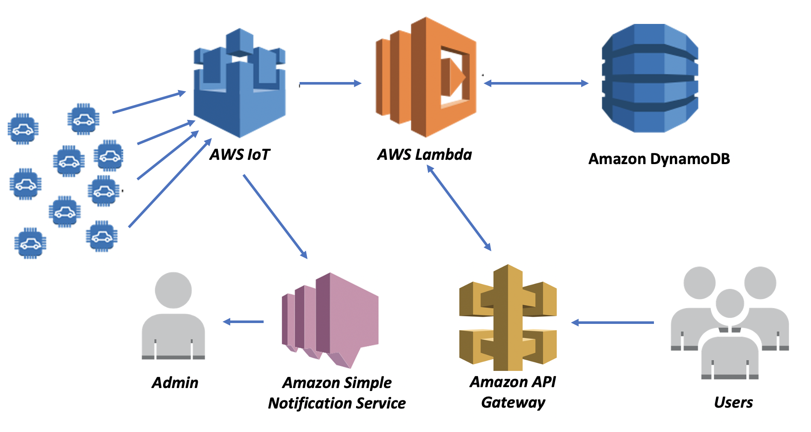
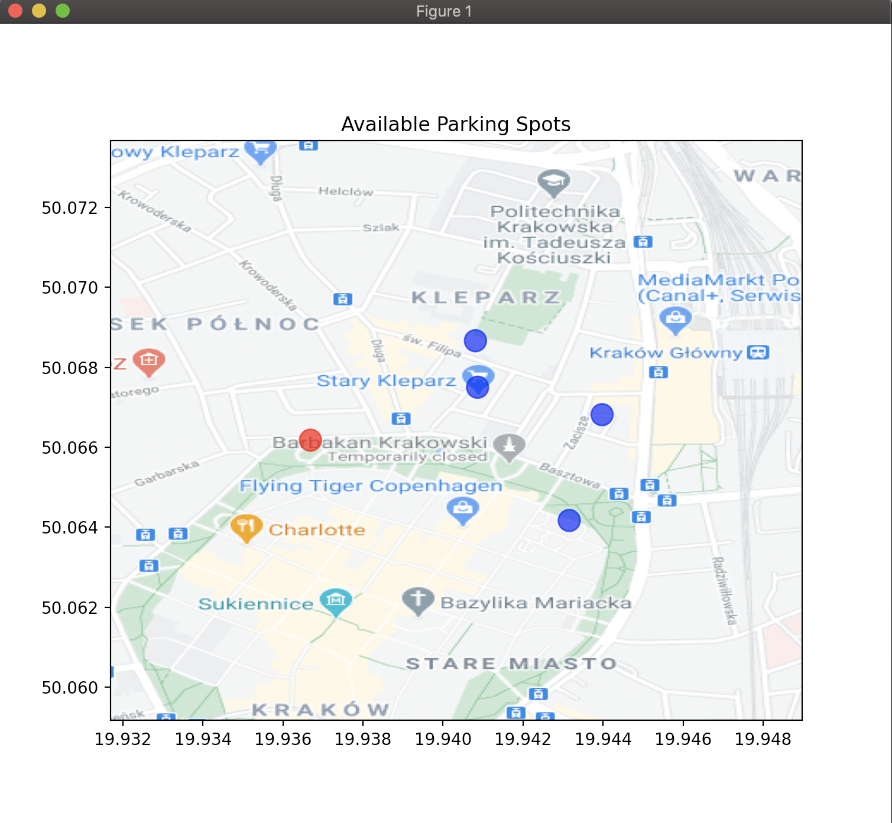

# SmartParking
A project created for IoT class at AGH University of Science and Technology. It emulates the basic workings of a smart parking system, giving users the ability to discover available parking spots closest to their current location. 

Authors:
- Izabela Czajowska
- Jerzy Jędrzejaszek
- Agata Nowara
- Kinga Wierchomska

## Description

In essence, the project consists of a client app and scripts representing parking sensors. The scripts communicate their status to a database, which the client app then queries through a series of intermediaries.

Technology-wise the project is based on Amazon's web services, specifically API Gateway, DynamoDB, Lambda and the IoT Core. To aid with the specifics of the topic we used an extension library for DynamoDB used for managing geographic position data. The scripts representing the client app and IoT devices are written in Python.

To describe the sequence of operation in more detail:
1. After being turned on, a sensor will begin periodically sending MQTT messages to IoT Core with updates on its current status
2. These messages are forwarded to Lambda, where a dedicated handler function will update the device's status in the database. If the device is connecting for the first time, the function will create a corresponding entry in the database.
3. Eventually, a client app will make a request to find nearby parking spaces. This occurs via HTTP. The request is recieved by the API Gateway and forwarded to a handler function in Lambda. This function conducts the search based on client-specified parameters and replies with a set of spots that match the criteria. These are then sent back to the client as JSON in a HTTP response.

## Architecture scheme
  

## Presentation

### Examplary input
  

### Visualisation
  

